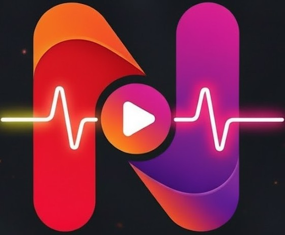

# NABZ-AI — Pitch Deck

  

**Yapay Zeka Destekli İçerik ve Video Platformu**

---

## 1. Problem

### İçerik Üreticileri Neden Zorlanıyor?

- **Zaman ve maliyet:** Profesyonel video üretimi haftalar sürüyor; ekip, ekipman ve yazılım maliyetleri yüksek.
- **Teknik engel:** Metin fikrinden görsel hikâyeye geçiş çoğu üretici için zor; AI araçları dağınık ve entegre değil.
- **Platform bağımlılığı:** Büyük platformlarda algoritma ve politika değişimleri geliri ve erişimi doğrudan etkiliyor.
- **Monetizasyon belirsizliği:** Abonelik, reklam ve sponsorluk modelleri karmaşık; gelir dağılımı şeffaf değil.
- **Yasal uyum:** KVKK, CCPA, LGPD, DMCA gibi gereklilikler küçük üreticiler için yük oluşturuyor.

**Özet:** İçerik üreticileri hızlı üretim, adil gelir ve yasal güvence istiyor; mevcut ekosistem bunu tek çatı altında sunmuyor.

---

## 2. Çözüm: NABZ-AI (Nabız)

### Metni Videoya, Fikri Gelire Dönüştüren Platform

**NABZ-AI**, yapay zeka destekli tek bir platformda:

- **Saniyeler içinde video:** Metin girişi → senaryo, görsel ve ses işleme → sinematik kısa/uzun form video.
- **Keşif ve dağıtım:** Trending, kategori, akıllı arama ve kişiselleştirilmiş önerilerle içerik öne çıkar.
- **Kanal ve monetizasyon:** Her üretici kendi kanalını açar; cüzdan, abonelik ve gelir takibi tek yerden yönetilir.
- **Şeffaf ve uyumlu altyapı:** Kullanım şartları, gizlilik, KVKK/CCPA/LGPD, DMCA ve reklam politikaları platformda net tanımlı; şeffaflık raporları ile güven sağlanır.

**Tek cümleyle:** Nabız, metninizi AI ile videoya çeviren, keşif ve kanal geliri sunan, yasal uyuma hazır bir içerik platformudur.

---

## 3. İş Modeli

### Sürdürülebilir ve Ölçeklenebilir Gelir

| Gelir Kanalı | Açıklama |
|--------------|----------|
| **Yıllık lisans (uygulama başına)** | Her entegre uygulama / white-label kurulum için **yıllık 30.000 USD** sabit lisans ücreti. |
| **Komisyon** | Platform üzerinden elde edilen üretici gelirlerinden **%10** komisyon. |
| **Reklam geliri** | Video ve keşif alanlarındaki reklam envanterinden elde edilen gelir; platform ve üretici payı ile dağıtılır. |

**Neden bu model?**

- **Öngörülebilir gelir:** Yıllık lisans, operasyonel planlama ve yatırım için net bir taban sağlar.
- **Hizalı teşvik:** Komisyon ve reklam payı, platformun üretici başarısını artırmaya odaklanmasını sağlar.
- **Ölçek:** Yeni uygulamalar ve bölgeler eklendikçe lisans sayısı ve toplam işlem hacmi büyür.

---

## 4. Global Vizyon

### Tek Platform, Çok Pazar

- **Çoklu dil ve bölge:** Ülke bazlı içerik filtreleme ve dil seçenekleri ile farklı coğrafyalara uyum.
- **Ekosistem modeli:** Ekosistem sahipleri kendi kullanıcı ağlarını yönetir; platform hem B2B hem B2C ölçeklenir.
- **Yasal uyum:** KVKK (Türkiye), CCPA (ABD), LGPD (Brezilya) ve küresel reklam politikalarına uyum hedeflenir.
- **Mall ve genişleme:** Sanal mağaza (Mall) ve AI modelleri sayfaları ile platform, “içerik + ticaret + AI” hub’ına dönüşür.

**Hedef:** İçerik üreticileri ve markalar için tek giriş noktası; yerel pazarlara hızlı, uyumlu ve kârlı giriş.

---

## 5. Teknik Altyapı

### Modern Stack ve Cursor ile Geliştirme

**Kullanılan teknolojiler**

- **Frontend:** Next.js (App Router), React, TypeScript, Tailwind CSS, Framer Motion.
- **Backend & veritabanı:** Firebase (Auth, Firestore, Storage).
- **İsteğe bağlı mobil:** Capacitor ile native uygulama çıktısı.
- **E-posta & entegrasyonlar:** Resend, OpenAI API; NABZ yerel API (Flask köprüsü) ile özel iş akışları.

**Cursor kullanımı**

- Geliştirme, **Cursor IDE** ile yapılmaktadır: AI destekli kod tamamlama, refactoring ve hata ayıklama ile hız ve kalite artırılmaktadır.
- Kod tabanı TypeScript ve modüler yapı ile tutulur; Cursor ile dokümantasyon ve standartlara uyum kolaylaştırılır.
- Teknik altyapı, hızlı iterasyon ve güvenli deployment (Firebase, script’ler, ortam değişkenleri) için tasarlanmıştır.

**Sonuç:** Ölçeklenebilir, bakımı kolay ve yeni özelliklerin hızlı eklenebileceği bir temel.

---

## Özet

| Başlık | Mesaj |
|--------|--------|
| **Problem** | İçerik üretimi pahalı ve dağınık; monetizasyon ve yasal uyum belirsiz. |
| **Çözüm** | NABZ-AI: metin → AI video, keşif, kanal ve şeffaf gelir. |
| **İş modeli** | 30.000 USD/yıl (uygulama başına) + %10 komisyon + reklam geliri. |
| **Vizyon** | Çoklu dil/bölge, ekosistem ve yasal uyumla global platform. |
| **Teknik** | Next.js, Firebase, TypeScript; Cursor ile hızlı ve kaliteli geliştirme. |

---

*NABZ-AI — Fikirden videoya, videodan gelire.*
